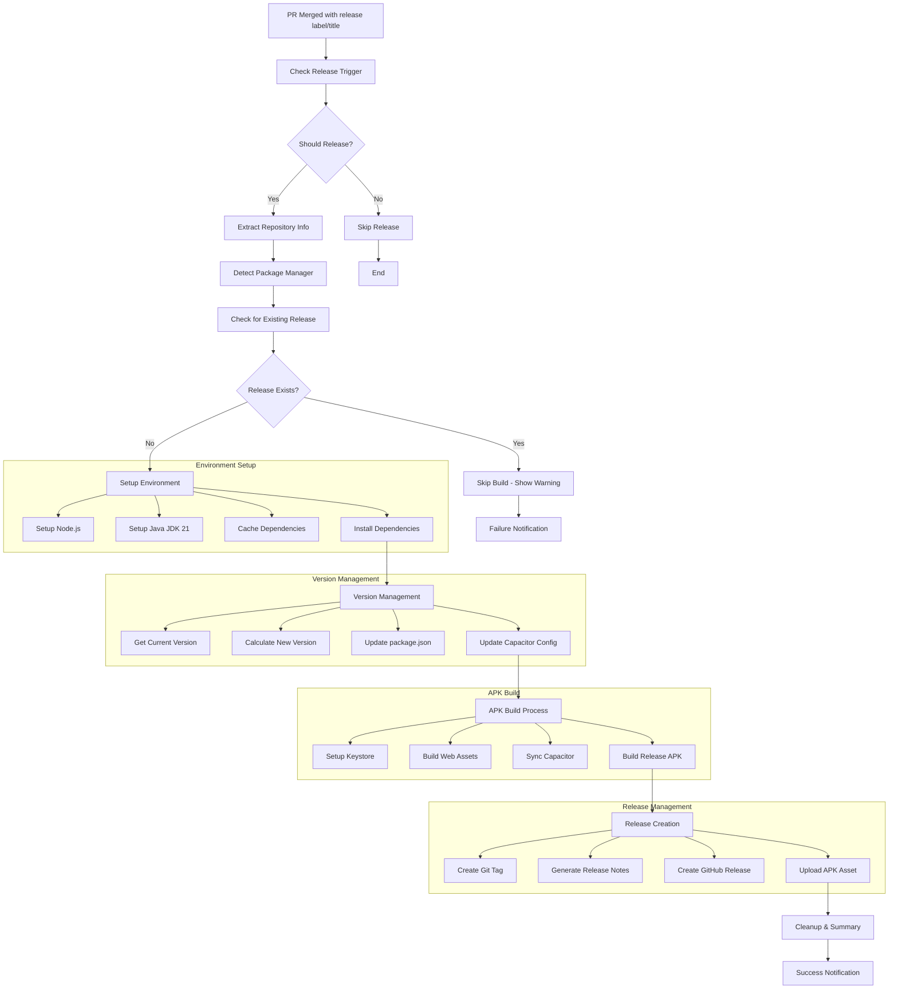

# 🚀 Automated APK Release Workflow for Ionic/Capacitor Apps

This workflow automates the process of building and releasing APK files for Ionic applications using Capacitor. It supports automatic version bumping, APK building, and GitHub release creation.

## 🔄 Workflow Architecture



## 📋 Prerequisites

- Ionic/Capacitor project with `android/` folder
- GitHub repository
- Android keystore file for signing
- Package manager (npm, yarn, or pnpm)

## 🛠️ Setup Steps

### 1. Create Workflow Directory

```bash
mkdir -p .github/workflows
```

### 2. Add Workflow File

Copy the `release-apk.yml` workflow file to `.github/workflows/release-apk.yml`

### 3. Setup Android Keystore

Generate a keystore file for signing your APK:

```bash
# Generate keystore (if you don't have one)
keytool -genkeypair -v -storetype PKCS12 \
  -keystore upload-keystore.keystore \
  -alias upload \
  -keyalg RSA \
  -keysize 2048 \
  -validity 10000
```

### 4. Configure GitHub Secrets

Go to **Settings > Secrets and variables > Actions** and add:

| Secret Name                 | Description                  | Example                      |
| --------------------------- | ---------------------------- | ---------------------------- |
| `RELEASE_KEYSTORE_BASE64`   | Base64 encoded keystore file | `cat keystore.jks \| base64` |
| `RELEASE_KEYSTORE_PASSWORD` | Keystore password            | `yourpassword`               |
| `RELEASE_KEY_ALIAS`         | Key alias name               | `upload`                     |
| `RELEASE_KEY_PASSWORD`      | Key password                 | `yourpassword`               |

### 5. Update Android Configuration

Add to `android/app/build.gradle`:

```gradle
android {
    signingConfigs {
        release {
            storeFile file('upload-keystore.keystore')
            storePassword System.getenv('RELEASE_KEYSTORE_PASSWORD')
            keyAlias System.getenv('RELEASE_KEY_ALIAS')
            keyPassword System.getenv('RELEASE_KEY_PASSWORD')
        }
    }
    buildTypes {
        release {
            signingConfig signingConfigs.release
            minifyEnabled false
            proguardFiles getDefaultProguardFile('proguard-android.txt'), 'proguard-rules.pro'
        }
    }
}
```

## 🎯 Triggering Releases

### Method 1: PR Labels

1. Create a pull request
2. Add `release` label to the PR
3. Merge the PR

### Method 2: PR Title Keywords

Include release keywords in your PR title:

- `[release]` - Triggers a patch release
- `[minor]` or `feat:` - Triggers a minor version bump
- `[major]` or `BREAKING CHANGE` - Triggers a major version bump

### Version Bumping Logic

```mermaid
flowchart TD
    A[Analyze PR Title] --> B{Contains Keywords?}
    B -->|[major] or BREAKING CHANGE| C[Major Version Bump]
    B -->|[minor] or feat/feature| D[Minor Version Bump]
    B -->|Default| E[Patch Version Bump]

    C --> F[Update Version Numbers]
    D --> F
    E --> F

    F --> G[Update package.json]
    F --> H[Update capacitor.config.ts]
    F --> I[Update android/app/build.gradle]
```

## 📦 What the Workflow Does

### Release Detection & Setup

1. **🔍 Release Trigger Check** - Validates if release should proceed
2. **📋 Repository Analysis** - Extracts repo info and detects package manager
3. **🔒 Existing Release Check** - Prevents duplicate releases

### Build Environment

1. **🏗️ Environment Setup** - Configures Node.js, Java, and dependencies
2. **📦 Package Manager Detection** - Auto-detects npm, yarn, or pnpm
3. **💾 Dependency Caching** - Speeds up subsequent builds

### Version Management

1. **📈 Version Calculation** - Determines new version based on PR title/labels
2. **📝 File Updates** - Updates version in package.json, Capacitor config, and Android files
3. **🏷️ Git Tagging** - Creates and pushes version tags

### APK Building

1. **🔑 Keystore Setup** - Configures Android signing keys
2. **🌐 Web Build** - Compiles Ionic web assets
3. **📱 Capacitor Sync** - Syncs web assets to native Android project
4. **🔨 APK Build** - Builds signed release APK

### Release Creation

1. **📝 Release Notes** - Generates comprehensive release notes
2. **🎉 GitHub Release** - Creates GitHub release with APK attachment
3. **🧹 Cleanup** - Removes sensitive files and provides summary

## 🔧 Customization Options

### Package Manager Support

The workflow automatically detects and supports:

- 📦 **npm** (package-lock.json)
- 🧶 **yarn** (yarn.lock)
- ⚡ **pnpm** (pnpm-lock.yaml)

### Custom Build Commands

Modify the build steps for your specific needs:

```yaml
- name: Build Web Assets
  run: |
    npm run build:prod  # Your custom build command

- name: Build Release APK
  run: |
    cd android
    ./gradlew assembleRelease --no-daemon --stacktrace
```

### Environment Variables

Add custom environment variables in the workflow:

```yaml
- name: Setup Environment Variables
  run: |
    echo "CUSTOM_API_URL=${{ secrets.API_URL }}" >> $GITHUB_ENV
    echo "BUILD_MODE=production" >> $GITHUB_ENV
```

## 🚨 Troubleshooting

### Common Issues & Solutions

#### 1. **Keystore Problems**

```bash
# Verify keystore integrity
keytool -list -v -keystore upload-keystore.keystore

# Check base64 encoding
cat upload-keystore.keystore | base64 | tr -d '\n'
```

#### 2. **Build Failures**

- **Java Version**: Ensure JDK 21 is being used
- **Gradle Issues**: Check `android/gradle/wrapper/gradle-wrapper.properties`
- **Capacitor Sync**: Verify `capacitor.config.ts` is properly configured

#### 3. **Version Conflicts**

- Ensure `versionCode` increments properly in `android/app/build.gradle`
- Check semantic versioning in `package.json`
- Verify no manual version changes conflict with automated bumping

#### 4. **Permission Issues**

- Verify GitHub token has proper permissions
- Check repository settings allow Actions to create releases
- Ensure secrets are properly configured

### Debug Mode

Enable debug logging by adding to your workflow:

```yaml
env:
  ACTIONS_STEP_DEBUG: true
  ACTIONS_RUNNER_DEBUG: true
```

## 📱 Example Usage Scenarios

### Scenario 1: Feature Release

```bash
# Create feature branch
git checkout -b feature/new-login-screen

# Make changes and commit
git commit -m "feat: Add biometric authentication to login"

# Create PR with title containing [minor]
# Title: "feat: Add biometric authentication [minor]"
# Add 'release' label and merge
```

### Scenario 2: Hotfix Release

```bash
# Create hotfix branch
git checkout -b hotfix/auth-bug

# Fix the issue
git commit -m "fix: Resolve authentication timeout issue"

# Create PR with title containing [release]
# Title: "fix: Authentication timeout [release]"
# Merge PR - triggers patch release
```

### Scenario 3: Breaking Change

```bash
# Create feature branch
git checkout -b feature/api-v2

# Implement breaking changes
git commit -m "feat!: Migrate to API v2 - BREAKING CHANGE"

# Create PR with "BREAKING CHANGE" in title
# Title: "feat: Migrate to API v2 - BREAKING CHANGE"
# Triggers major version bump
```

## 🔍 Monitoring & Analytics

### Release Artifacts

Each successful release creates:

1. **📱 APK File** - Signed and ready for distribution
2. **🏷️ Git Tag** - Semantic version tag (e.g., `v1.2.3`)
3. **📄 Release Notes** - Auto-generated changelog
4. **📊 Build Logs** - Detailed workflow execution logs

### Success Metrics

The workflow provides these metrics in the summary:

- Build duration
- APK file size
- Version bump type
- Changed files count
- Dependencies updated

---

**💡 Pro Tips:**

1. **Test First**: Always test the workflow on a feature branch before using on main
2. **Backup Keystore**: Keep multiple copies of your keystore file securely
3. **Monitor Releases**: Set up notifications for release success/failure
4. **Version Strategy**: Plan your version bumping strategy in advance
5. **Security**: Regularly rotate signing keys and update secrets

**🚀 Ready to automate your releases? Copy the workflow file and start shipping faster!**
