# 🚀 Automated APK Release Workflow for React Native Apps

This workflow automates the complete process of building and releasing APK files for React Native applications. It handles version management, APK building with proper signing, and creates GitHub releases automatically.

## 🔄 Workflow Architecture


## 📋 Prerequisites

Before setting up this workflow, ensure you have:

- ✅ React Native project with `android/` directory
- ✅ GitHub repository with Actions enabled
- ✅ Android keystore file for APK signing
- ✅ One of the supported package managers (npm, yarn, pnpm)
- ✅ Proper Android development environment setup

## 🛠️ Detailed Setup Guide

### 1. Create Workflow Directory

```bash
# Create the GitHub workflows directory
mkdir -p .github/workflows
```

### 2. Add Workflow File

Copy the `release-apk.yml` file to `.github/workflows/release-apk.yml` in your repository.

### 3. Android Keystore Setup

#### Generate a New Keystore (if needed):

```bash
# Generate a new keystore for release signing
keytool -genkeypair -v -storetype PKCS12 \
  -keystore my-upload-key.keystore \
  -alias my-key-alias \
  -keyalg RSA \
  -keysize 2048 \
  -validity 10000 \
  -dname "CN=Your Name, OU=Your Org, O=Your Company, L=Your City, S=Your State, C=Your Country"
```

#### Convert Keystore to Base64:

```bash
# Convert keystore to base64 for GitHub secrets
cat my-upload-key.keystore | base64 | tr -d '\n' > keystore_base64.txt
```

### 4. Configure GitHub Secrets

Navigate to **Settings > Secrets and variables > Actions** and add these secrets:

| Secret Name                 | Description                   | How to Get                   |
| --------------------------- | ----------------------------- | ---------------------------- |
| `RELEASE_KEYSTORE_BASE64`   | Base64 encoded keystore file  | `cat keystore.jks \| base64` |
| `RELEASE_KEYSTORE_PASSWORD` | Password for the keystore     | Your keystore password       |
| `RELEASE_KEY_ALIAS`         | Alias name used in keystore   | Alias from keytool command   |
| `RELEASE_KEY_PASSWORD`      | Password for the specific key | Your key password            |

### 5. Update Android Build Configuration

#### Update `android/app/build.gradle`:

```gradle
android {
    signingConfigs {
        release {
            storeFile file('release-key.keystore')
            storePassword System.getenv('RELEASE_KEYSTORE_PASSWORD')
            keyAlias System.getenv('RELEASE_KEY_ALIAS')
            keyPassword System.getenv('RELEASE_KEY_PASSWORD')
        }
    }

    buildTypes {
        release {
            signingConfig signingConfigs.release
            minifyEnabled enableProguardInReleaseBuilds
            proguardFiles getDefaultProguardFile("proguard-android.txt"), "proguard-rules.pro"
        }
    }
}
```

#### Create `android/gradle.properties` (if not exists):

```properties
# Enable daemon for faster builds
org.gradle.daemon=true
org.gradle.configureondemand=true
org.gradle.jvmargs=-Xmx4096m -XX:MaxPermSize=512m -XX:+HeapDumpOnOutOfMemoryError -Dfile.encoding=UTF-8

# Android specific
android.useAndroidX=true
android.enableJetifier=true
```

## 🎯 Release Triggering Methods

### Method 1: Pull Request Labels

```mermaid
flowchart LR
    A[Create PR] --> B[Add 'release' label]
    B --> C[Merge PR]
    C --> D[🚀 Release Triggered]
```



1. Create a pull request with your changes
2. Add the `release` label to the PR
3. Merge the PR to trigger the release

### Method 2: Pull Request Title Keywords

Include specific keywords in your PR title:

```mermaid
flowchart TD
    A[PR Title Analysis] --> B{Keyword Detection}
    B -->|[major] or BREAKING CHANGE| C[Major: 1.0.0 → 2.0.0]
    B -->|[minor] or feat/feature| D[Minor: 1.0.0 → 1.1.0]
    B -->|[release] or default| E[Patch: 1.0.0 → 1.0.1]

    C --> F[Version Update]
    D --> F
    E --> F
```

**Examples:**

- `feat: Add new user dashboard [minor]` → Minor version bump
- `fix: Critical security patch [release]` → Patch version bump
- `feat!: New API structure - BREAKING CHANGE` → Major version bump

### Method 3: Label-Based Triggering

When a `release` label is added to a merged PR, it can trigger the workflow even after the merge.

## 📦 Comprehensive Workflow Process

### Phase 1: Pre-Build Validation


### Phase 2: Environment & Dependencies

1. **Repository Information Extraction**

   - Extract repository name for APK naming
   - Determine build context and branch information

2. **Package Manager Detection**

   - Auto-detects based on lock files:
     - `package-lock.json` → npm
     - `yarn.lock` → yarn
     - `pnpm-lock.yaml` → pnpm

3. **Environment Setup**
   - Node.js 20 with package manager caching
   - Java JDK 17 for Android builds
   - Python 3.11 for build scripts

### Phase 3: Version Management


**Version Calculation Logic:**

```javascript
// Pseudo-code for version bumping
const currentVersion = require('./package.json').version;
const [major, minor, patch] = currentVersion.split('.').map(Number);

switch(bumpType) {
  case 'major': return `${major + 1}.0.0`;
  case 'minor': return `${major}.${minor + 1}.0`;
  case 'patch': return `${major}.${minor}.${patch + 1}`;
}
```

### Phase 4: APK Build Process

1. **Keystore Configuration**

   - Decode base64 keystore from secrets
   - Set up signing configuration
   - Configure environment variables

2. **React Native Codegen**

   - Generate native code interfaces
   - Prepare native modules

3. **APK Building**
   - Clean previous builds
   - Build release APK with signing
   - Verify APK integrity and size

### Phase 5: Release Creation

1. **Git Tagging**

   - Create semantic version tag (e.g., `v1.2.3`)
   - Push tag to repository

2. **Release Notes Generation**

   - Extract PR description and commit messages
   - Format comprehensive release notes

3. **GitHub Release**
   - Create release with generated notes
   - Upload signed APK as release asset
   - Include download statistics and metadata

## 🔧 Advanced Customization

### Custom Environment Variables

Add environment-specific variables in the workflow:

```yaml
- name: Setup Environment Variables
  run: |
    echo "GOOGLE_GEMINI_API_KEY=${{ secrets.GEMINI_API_KEY }}" >> $GITHUB_ENV
    echo "API_BASE_URL=${{ secrets.API_URL }}" >> $GITHUB_ENV
    echo "BUILD_MODE=production" >> $GITHUB_ENV
```

### Custom Build Commands

Modify build steps for specific requirements:

```yaml
- name: Custom Pre-build Tasks
  run: |
    # Generate environment-specific config
    npm run generate-config

    # Run custom scripts
    npm run pre-build:production

- name: Build Release APK
  run: |
    cd android
    # Custom Gradle options
    ./gradlew assembleRelease \
      --no-daemon \
      --stacktrace \
      --info \
      -Dorg.gradle.jvmargs="-Xmx4096m"
```

### Multi-Flavor Support

For apps with multiple flavors:

```yaml
- name: Build Multiple Flavors
  run: |
    cd android
    ./gradlew assembleProductionRelease
    ./gradlew assembleStagingRelease
    ./gradlew assembleDebugRelease
```

## 🚨 Troubleshooting Guide

### Common Issues & Solutions

#### 1. **Keystore and Signing Issues**

**Problem**: APK signing fails

```bash
# Validate keystore
keytool -list -v -keystore my-upload-key.keystore

# Check keystore password
keytool -list -keystore my-upload-key.keystore -storepass YOUR_PASSWORD
```

**Solution**:

- Verify all keystore secrets are correctly set
- Ensure keystore file is valid and not corrupted
- Check password complexity (avoid special characters that might be escaped)

#### 2. **Build Environment Issues**

**Problem**: Build fails due to environment setup

```bash
# Check Java version
java -version
javac -version

# Verify Android SDK
echo $ANDROID_HOME
ls $ANDROID_HOME/platforms
```

**Solution**:

- Ensure Java 17 is being used (not Java 8 or 21)
- Verify Android SDK is properly configured
- Check Gradle wrapper version compatibility

#### 3. **Memory and Performance Issues**

**Problem**: Build runs out of memory

```gradle
// In android/gradle.properties
org.gradle.jvmargs=-Xmx4096m -XX:MaxMetaspaceSize=512m
org.gradle.daemon=true
org.gradle.configureondemand=true
```

**Solution**:

- Increase JVM heap size
- Enable Gradle daemon for faster builds
- Use parallel builds where possible

#### 4. **Version Conflicts**

**Problem**: Version numbers conflict or don't increment

```bash
# Check current version
node -p "require('./package.json').version"

# Verify Android version code
grep versionCode android/app/build.gradle
```

**Solution**:

- Ensure versionCode is properly incremented
- Check for manual version changes that conflict
- Verify semantic versioning format in package.json

#### 5. **Dependencies and Node Modules**

**Problem**: Dependency installation fails

```bash
# Clear caches
npm cache clean --force
rm -rf node_modules package-lock.json
npm install

# For yarn
yarn cache clean
rm -rf node_modules yarn.lock
yarn install
```

### Debug Mode

Enable verbose logging for troubleshooting:

```yaml
env:
  ACTIONS_STEP_DEBUG: true
  ACTIONS_RUNNER_DEBUG: true
  GRADLE_OPTS: "-Dorg.gradle.logging.level=debug"
```

## 📊 Monitoring & Analytics

### Release Metrics

Each workflow run provides:

1. **Build Performance**

   - Total build time
   - Dependency installation time
   - APK build duration

2. **APK Analysis**

   - APK file size
   - Compression ratio
   - Asset breakdown

3. **Version Information**
   - Previous version → New version
   - Version bump type
   - Commit count since last release

### Success Indicators

✅ **Successful Release Includes:**

- APK file uploaded to GitHub release
- Git tag created and pushed
- Release notes generated
- Build artifacts cleaned up
- Summary report with metrics

## 📱 Real-World Usage Examples

### Example 1: Feature Release with Minor Version Bump

```bash
# Development workflow
git checkout -b feature/payment-integration
# ... make changes ...
git commit -m "feat: Add PayPal payment integration"

# Create PR
# Title: "feat: Add PayPal payment integration [minor]"
# Description: "Implements PayPal SDK integration for checkout process"
# Add 'release' label
# Merge PR → Triggers v1.1.0 release
```

### Example 2: Critical Bug Fix

```bash
# Hotfix workflow
git checkout -b hotfix/login-crash
# ... fix the bug ...
git commit -m "fix: Resolve app crash on login"

# Create PR
# Title: "fix: Critical login crash [release]"
# Merge PR → Triggers v1.0.1 release
```

### Example 3: Breaking API Changes

```bash
# Major version change
git checkout -b feature/api-v2-migration
# ... implement breaking changes ...
git commit -m "feat!: Migrate to API v2 - BREAKING CHANGE: Authentication flow changed"

# Create PR
# Title: "feat: API v2 Migration - BREAKING CHANGE"
# Merge PR → Triggers v2.0.0 release
```

## 🎯 Best Practices

### 1. **Release Strategy**

- Plan version bumps in advance
- Use conventional commit messages
- Test releases on feature branches first

### 2. **Security**

- Rotate keystore passwords regularly
- Use different keystores for debug/release
- Monitor secret access logs

### 3. **Performance**

- Enable Gradle build cache
- Use dependency caching effectively
- Optimize APK size with ProGuard/R8

### 4. **Quality Assurance**

- Run tests before releases
- Use signed APKs for testing
- Validate APK installation on different devices

---

**🚀 Ready to automate your React Native releases?**

1. Copy the workflow file to your repository
2. Configure your secrets and keystore
3. Create a test PR with the `release` label
4. Merge and watch your first automated release!

**Need help?** Check the troubleshooting section or create an issue in the repository.
