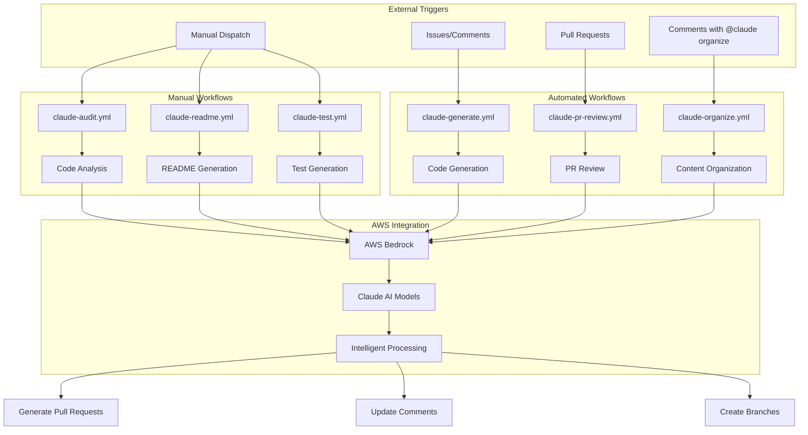
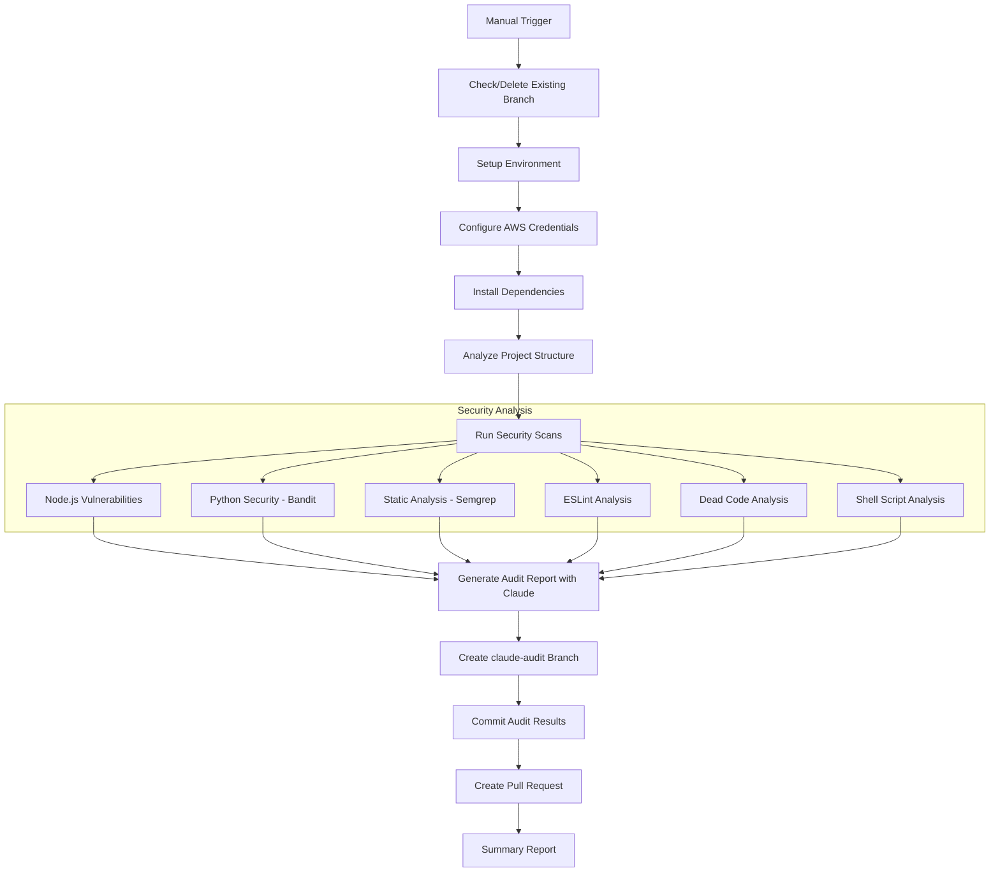
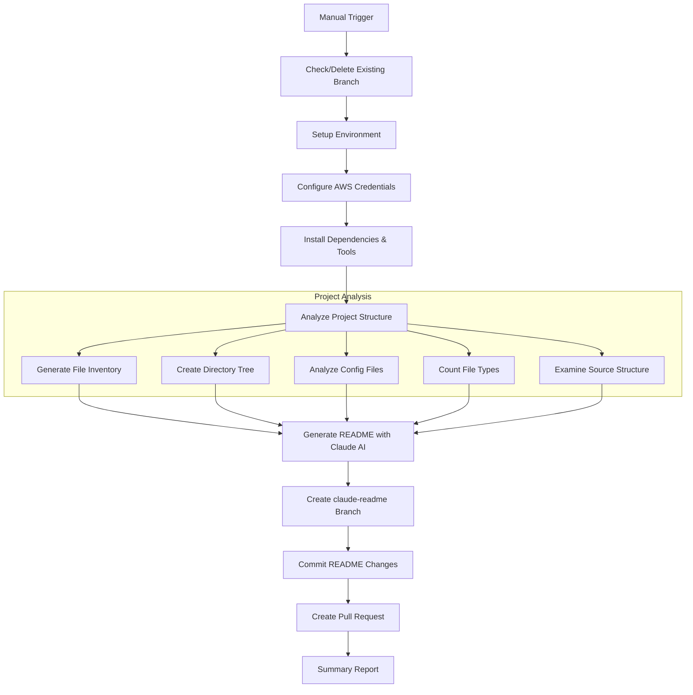
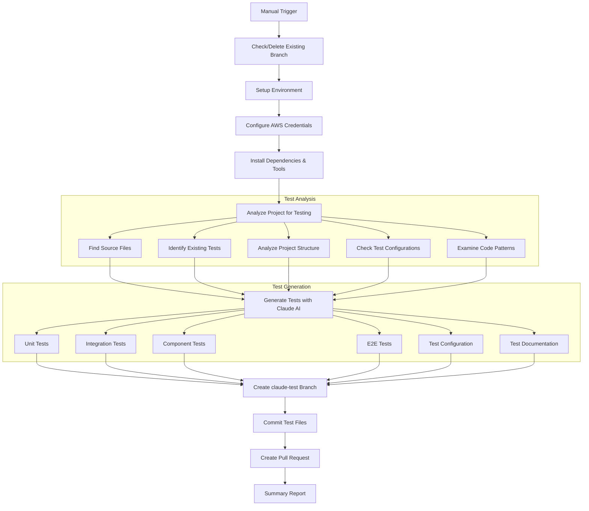
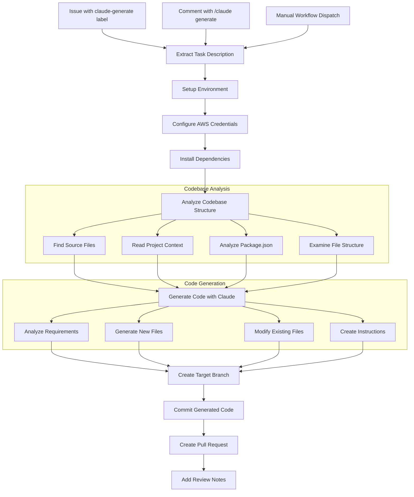
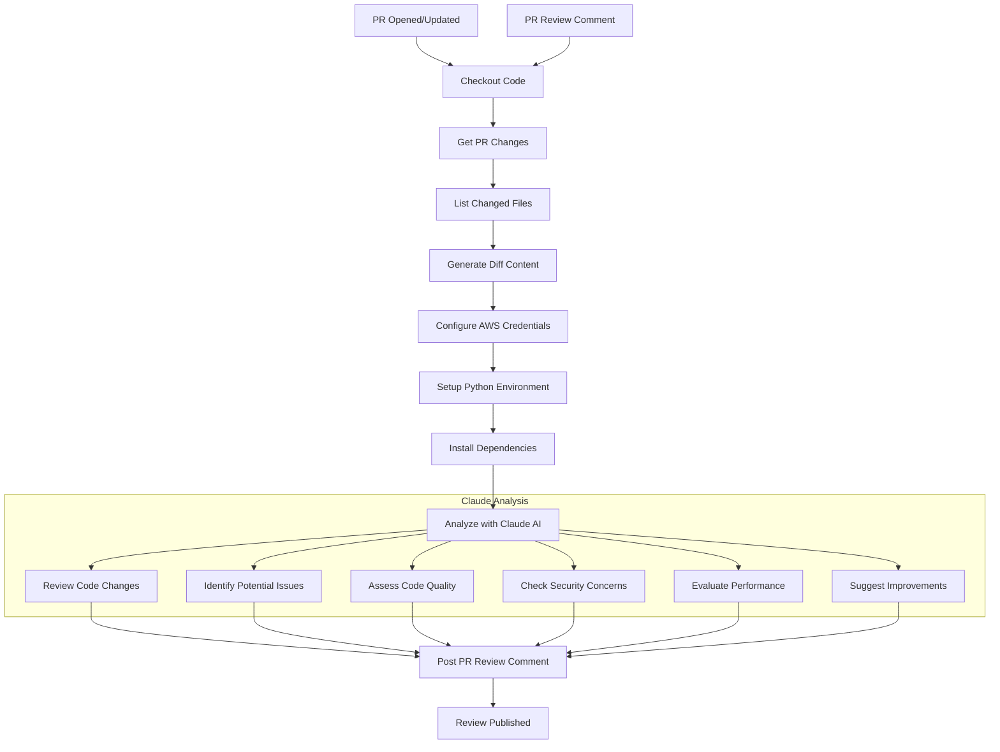
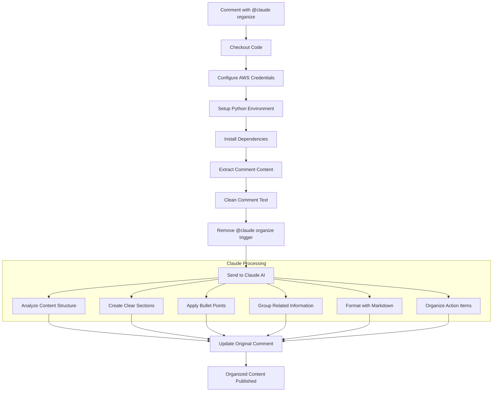

# Claude Workflows Documentation

This repository contains several Claude AI-powered GitHub workflows designed to automate various development tasks. Each workflow leverages Claude AI through AWS Bedrock to provide intelligent automation capabilities.

NOTE: GITHUB ACTIONS WORK WELL WITH REPO CONTAINING PACKAGE.json and its lock file

## � Workflow Architecture Overview



## �📋 Overview

| Workflow                              | Trigger Type  | Description                                        |
| ------------------------------------- | ------------- | -------------------------------------------------- |
| [claude-audit](#claude-audit)         | Manual        | Comprehensive codebase auditing and analysis       |
| [claude-readme](#claude-readme)       | Manual        | Intelligent README generation and updates          |
| [claude-test](#claude-test)           | Manual        | Automated test generation with multiple frameworks |
| [claude-generate](#claude-generate)   | Comment/Label | AI-powered code generation from issue descriptions |
| [claude-pr-review](#claude-pr-review) | Automatic     | Intelligent pull request review and feedback       |
| [claude-organize](#claude-organize)   | Comment       | Task organization and markdown beautification      |

## 🔧 Manual Workflows

These workflows must be triggered manually from the Actions tab in your GitHub repository.

### claude-audit

**File:** `.github/workflows/claude-audit.yml`  
**Trigger:** Manual (workflow_dispatch)

Performs comprehensive code auditing and analysis of your codebase using Claude AI.



**Features:**

- **Audit Scopes:** Choose from `all`, `security`, `performance`, `maintainability`, or `cleanup`
- **Improvement Suggestions:** Optional detailed recommendations
- **Automated Branch Management:** Creates and manages `claude-code-audit` branch
- **Pull Request Creation:** Generates PR with audit findings and suggestions

**How to Use:**

1. Go to Actions tab → Claude AI Code Audit
2. Click "Run workflow"
3. Select audit scope and options
4. Review the generated PR with audit results

---

### claude-readme

**File:** `.github/workflows/claude-readme.yml`  
**Trigger:** Manual (workflow_dispatch)

Generates comprehensive, intelligent README files for your project.



**Features:**

- **Project Structure Analysis:** Detailed breakdown of your codebase
- **Tech Stack Detection:** Automatic identification of technologies used
- **README Updates:** Can update existing README files
- **Branch Management:** Uses `claude-readme` branch for changes

**How to Use:**

1. Go to Actions tab → Claude AI README Generator
2. Click "Run workflow"
3. Configure options (detailed structure, tech analysis, update existing)
4. Review and merge the generated README

---

### claude-test

**File:** `.github/workflows/claude-test.yml`  
**Trigger:** Manual (workflow_dispatch)

Generates comprehensive test suites for your codebase using various testing frameworks.



**Features:**

- **Test Types:** Support for `unit`, `integration`, `e2e`, and `component` tests
- **Framework Support:** Auto-detection or manual selection (Jest, Vitest, Cypress, Playwright)
- **Coverage Targeting:** Configurable coverage percentage goals
- **Test Documentation:** Generates README for test suites

**How to Use:**

1. Go to Actions tab → Claude AI Test Generator
2. Click "Run workflow"
3. Select test type, framework, and coverage target
4. Review generated tests in the PR

## 🤖 Automated Workflows

These workflows trigger automatically based on specific conditions.

### claude-generate

**File:** `.github/workflows/claude-generate.yml`  
**Triggers:**

- Issues with `claude-generate` label
- Comments containing `/claude generate`
- Manual workflow dispatch

Generates code based on issue descriptions or comments using Claude AI.



**Features:**

- **Issue-Based Generation:** Creates code from GitHub issue descriptions
- **Comment Commands:** Use `/claude generate` in issue comments
- **Flexible Targeting:** Specify target branch for generated code
- **AWS Integration:** Uses AWS Bedrock for Claude AI access

**How to Use:**

1. **Via Issue Label:** Add `claude-generate` label to any issue
2. **Via Comment:** Type `/claude generate` in an issue comment
3. **Manual Trigger:** Use workflow dispatch with task description

---

### claude-pr-review

**File:** `.github/workflows/claude-pr-review.yml`  
**Triggers:**

- Pull request opened/synchronized/reopened
- Pull request review comments created

Provides intelligent code review using Claude AI for all pull requests.



**Features:**

- **Automatic Review:** Reviews all PR changes automatically
- **Diff Analysis:** Analyzes code changes and provides feedback
- **Comment Integration:** Responds to review comments
- **Multi-Language Support:** Works with various programming languages

**How to Use:**

- **Automatic:** Reviews trigger automatically on PR events
- **No manual action required**
- Claude will comment directly on your PR with review feedback

---

### claude-organize

**File:** `.github/workflows/claude-organize.yml`  
**Trigger:** Comments containing `@claude organize`

Organizes and beautifies task lists and content using Claude AI with markdown formatting.



**Features:**

- **Task Organization:** Restructures and organizes task lists
- **Markdown Beautification:** Applies proper markdown formatting
- **Comment Enhancement:** Improves readability and structure
- **Real-time Processing:** Processes comments as they're created

**How to Use:**

1. Type `@claude organize` followed by your tasks or content in any issue or PR comment
2. Claude will automatically organize and beautify the content
3. The organized content will be posted as a reply comment

**Example:**

```
@claude organize
- Fix bug in user authentication
- Update documentation
- Add unit tests
- Deploy to staging
```

## 🔐 Required Secrets

All workflows require the following GitHub secrets to be configured:

| Secret                  | Description                                                       |
| ----------------------- | ----------------------------------------------------------------- |
| `AWS_ACCESS_KEY_ID`     | AWS access key for Bedrock access                                 |
| `AWS_SECRET_ACCESS_KEY` | AWS secret key for Bedrock access                                 |
| `AWS_REGION`            | AWS region (e.g., `us-east-1`)                                    |
| `AWS_BEDROCK_MODEL_ID`  | Claude model ID (e.g., `anthropic.claude-3-sonnet-20240229-v1:0`) |
| `GITHUB_TOKEN`          | GitHub personal access token (automatically provided)             |

## 🚀 Getting Started

1. **Configure AWS Bedrock:** Ensure you have access to Claude models in AWS Bedrock
2. **Set Repository Secrets:** Add all required secrets in repository settings
3. **Enable Actions:** Ensure GitHub Actions are enabled for your repository
4. **Grant Permissions:** Workflows need write access to contents, pull requests, and issues

## 📝 Notes

- All workflows create separate branches for their changes to maintain clean git history
- Existing branches are automatically cleaned up before creating new ones
- Pull requests are created automatically for review and merging
- Workflows are designed to be safe and non-destructive to your main codebase

## 🤝 Contributing

When modifying workflows:

1. Test changes in a fork first
2. Ensure all required secrets are properly configured
3. Update this documentation for any new features
4. Follow the existing patterns for consistency
