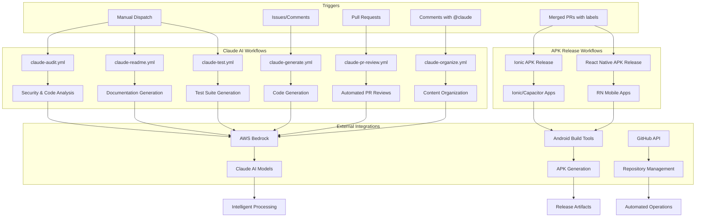
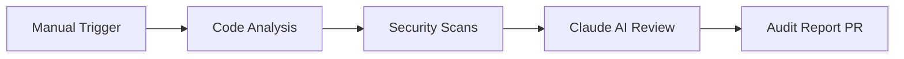
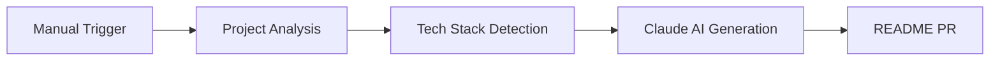
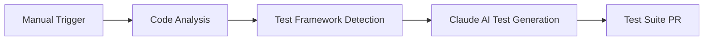
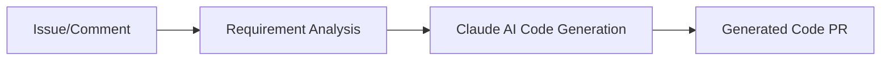
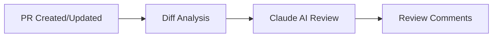
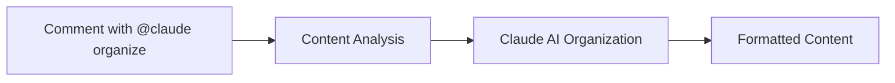
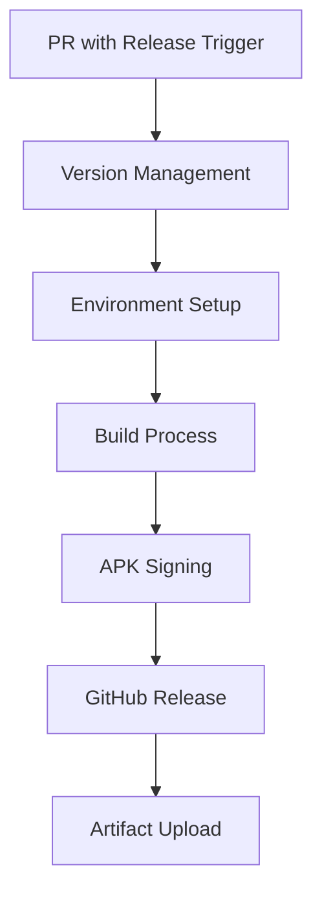

# 🔄 GitHub Workflows Collection

# 🚀 GitHub Workflows Collection

A comprehensive collection of GitHub Actions workflows for automating various development tasks, including AI-powered code analysis, automated APK releases, and intelligent development assistance.

## 🔄 Complete Workflow Architecture



## 📚 Workflow Categories

### 🤖 Claude AI-Powered Workflows

| Workflow             | Type      | Description                                    | Trigger                     |
| -------------------- | --------- | ---------------------------------------------- | --------------------------- |
| **claude-audit**     | Manual    | Comprehensive security & code quality analysis | `workflow_dispatch`         |
| **claude-readme**    | Manual    | Intelligent README generation and updates      | `workflow_dispatch`         |
| **claude-test**      | Manual    | Automated test suite generation                | `workflow_dispatch`         |
| **claude-generate**  | Automated | AI-powered code generation from issues         | Issues, Comments, Manual    |
| **claude-pr-review** | Automated | Intelligent pull request reviews               | PR events                   |
| **claude-organize**  | Automated | Content organization and formatting            | `@claude organize` comments |

### 📱 APK Release Workflows

| Workflow                     | Framework       | Description                         | Trigger                          |
| ---------------------------- | --------------- | ----------------------------------- | -------------------------------- |
| **Ionic APK Release**        | Ionic/Capacitor | Automated APK builds for Ionic apps | Merged PRs with release triggers |
| **React Native APK Release** | React Native    | Automated APK builds for RN apps    | Merged PRs with release triggers |

## 🔍 Detailed Workflow Information

### Claude AI Workflows

#### 🔒 Security Audit Workflow



**Features:**

- Multi-language security scanning
- Dead code detection
- Performance analysis
- Automated remediation suggestions

#### 📝 README Generator



**Features:**

- Automatic project structure analysis
- Technology stack detection
- Comprehensive documentation
- Markdown formatting

#### 🧪 Test Generator



**Features:**

- Multiple test framework support
- Unit, integration, and E2E tests
- Coverage targeting
- Test documentation

#### ⚡ Code Generator



**Features:**

- Issue-based code generation
- Comment-triggered generation
- Multi-language support
- Integration with existing codebase

#### 👀 PR Review



**Features:**

- Automatic code review
- Security vulnerability detection
- Best practice suggestions
- Multi-language support

#### 📋 Content Organizer



**Features:**

- Task list organization
- Markdown beautification
- Structure optimization
- Real-time processing

### APK Release Workflows

#### 📱 Mobile App Release Process



**Common Features:**

- Automatic version bumping
- Multi-package manager support
- Secure APK signing
- Release notes generation
- GitHub release creation

## 🛠️ Setup Requirements

### For Claude AI Workflows

**Required Secrets:**

- `AWS_ACCESS_KEY_ID` - AWS access key for Bedrock
- `AWS_SECRET_ACCESS_KEY` - AWS secret key
- `AWS_REGION` - AWS region (e.g., us-east-1)
- `AWS_BEDROCK_MODEL_ID` - Claude model ID
- `GITHUB_TOKEN` - Automatically provided

### For APK Release Workflows

**Required Secrets:**

- `RELEASE_KEYSTORE_BASE64` - Base64 encoded keystore
- `RELEASE_KEYSTORE_PASSWORD` - Keystore password
- `RELEASE_KEY_ALIAS` - Key alias name
- `RELEASE_KEY_PASSWORD` - Key password

## 🚀 Quick Start Guide

### 1. Choose Your Workflows

Select the workflows that match your project needs:

- **Node.js/TypeScript projects** → Claude AI workflows
- **Ionic/Capacitor apps** → Ionic APK Release
- **React Native apps** → RN APK Release

### 2. Setup Secrets

Configure the required secrets in your repository settings under **Settings > Secrets and variables > Actions**.

### 3. Copy Workflow Files

Copy the relevant `.yml` files to your `.github/workflows/` directory.

### 4. Test and Deploy

Start with manual workflows to test the setup, then enable automated workflows for production use.

## 📁 Directory Structure

```
workflows/
├── README.md (this file)
├── Claude Workflows/
│   ├── claude-audit.yml
│   ├── claude-readme.yml
│   ├── claude-test.yml
│   ├── claude-generate.yml
│   ├── claude-pr-review.yml
│   ├── claude-organize.yml
│   └── Readme.md
├── APK Release/
│   ├── Apk-Release/
│   │   ├── workflows/release-apk.yml
│   │   └── README.md
│   └── RN-Apk-release/
│       ├── workflows/release-apk.yml
│       └── README.md
└── Templates/
    ├── PULL_REQUEST_TEMPLATE.md
    └── ISSUE_TEMPLATE/
```

## 🤝 Contributing

We welcome contributions to improve these workflows:

1. **Fork the repository**
2. **Create a feature branch**
3. **Test your changes thoroughly**
4. **Update documentation** as needed
5. **Submit a pull request**

### Guidelines

- Follow existing code patterns
- Add comprehensive documentation
- Test workflows in isolated environments
- Update README files for any changes

## 📖 Additional Resources

- [GitHub Actions Documentation](https://docs.github.com/en/actions)
- [AWS Bedrock Documentation](https://docs.aws.amazon.com/bedrock/)
- [Ionic Capacitor Guide](https://capacitorjs.com/docs)
- [React Native Documentation](https://reactnative.dev/docs/getting-started)

## 🆘 Support

If you encounter issues:

1. Check the troubleshooting sections in individual workflow READMEs
2. Review GitHub Actions logs for error details
3. Verify all required secrets are configured
4. Create an issue with detailed error information

---

**🎯 Ready to automate your development workflow? Choose your starting point and begin shipping faster!**

## 📁 Repository Structure

### 🚀 APK Release Workflows

Automated Android APK building and release workflows for different package managers:

- **`Apk-Release-Adaptable/`** - Smart APK release workflow with automatic version bumping
- **`Apk-release-npm/`** - APK release workflow optimized for NPM-based projects
- **`RN-Apk-release-yarn/`** - React Native APK release workflow using Yarn package manager

**Key Features:**

- 🎯 Smart release detection via PR labels or titles
- 📈 Automatic version management (major/minor/patch)
- 🔐 Signed APK builds with secure keystore handling
- 📝 Auto-generated release notes

### 🤖 Claude AI Workflows

Intelligent workflows powered by Claude AI for automated code analysis and generation:

- **`claude-audit.yml`** - Comprehensive security & code quality auditing
- **`claude-generate.yml`** - AI-powered code generation from issue descriptions
- **`claude-organize.yml`** - Task organization and markdown beautification
- **`claude-pr-review.yml`** - Intelligent pull request reviews
- **`claude-readme.yml`** - Smart README generation and updates
- **`claude-test.yml`** - Automated test generation with multiple frameworks

**Key Features:**

- 🧠 AI-powered code analysis and suggestions
- 🔍 Security vulnerability scanning
- 📋 Automated documentation generation
- 🧪 Intelligent test creation

### 📝 Templates

Ready-to-use templates for consistent project management:

- **`PULL_REQUEST_TEMPLATE.md`** - Standardized PR format
- **`ISSUE_TEMPLATE/`** - Collection of issue templates:
  - `bug_report.yml` - Bug reporting template
  - `documentation_bug.yml` - Documentation issue template
  - `enhancement_request.yml` - Enhancement request template
  - `feature_request.yml` - Feature request template

## 🚀 Quick Start

1. **Choose your workflow category** based on your project needs
2. **Copy the relevant workflow files** to your project's `.github/workflows/` directory
3. **Configure required secrets** (see individual workflow documentation)
4. **Customize triggers and parameters** as needed

## 📚 Documentation

Each workflow category includes detailed documentation:

- `RELEASE_WORKFLOW.md` - Setup and usage instructions
- `SECRETS_SETUP.md` - Required secrets configuration
- Individual README files with specific details

## 🔧 Requirements

### For APK Release Workflows:

- Android project with Gradle build system
- Release keystore and signing credentials
- GitHub repository secrets configured

### For Claude AI Workflows:

- AWS Bedrock access with Claude AI models
- Package.json file in repository (recommended)
- Appropriate repository permissions

## 🤝 Contributing

Feel free to submit issues, feature requests, or pull requests to improve these workflows. Each workflow is designed to be modular and easily customizable for different project requirements.

## 📄 License

These workflows are provided as-is for educational and development purposes. Please review and test thoroughly before using in production environments.
